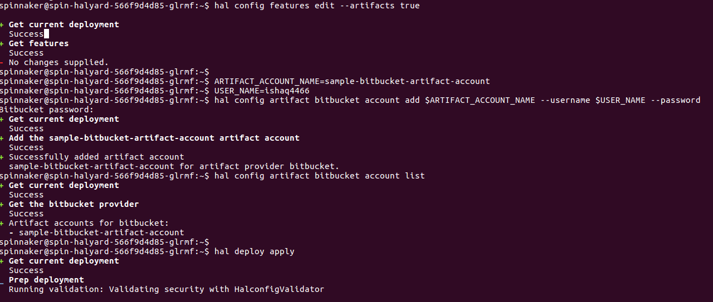
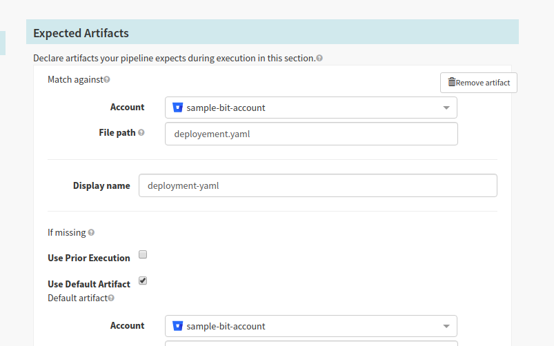
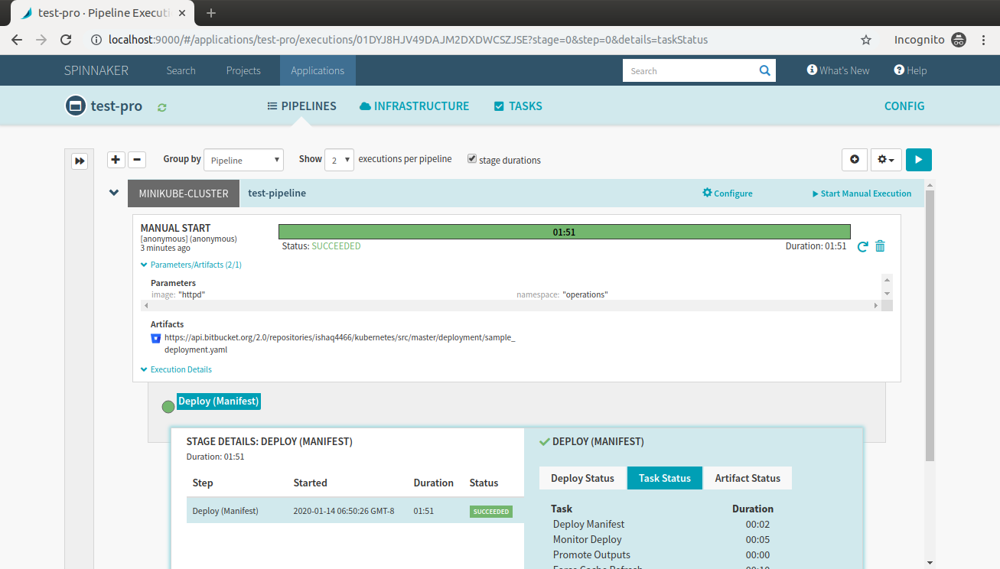
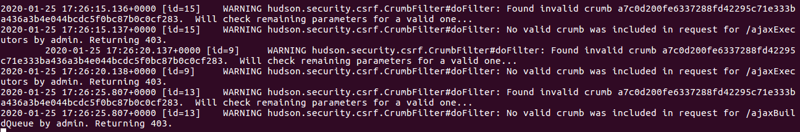

Table of Content
===================

* [Artifact account](#artifact-account)
	* [Configuring bitbucket as an artifact account](#configuring-bitbucket-as-an-artifact-account)
* [Spin CLI](#spin-cli)
* [Upgrading spinnaker version](#upgrading-spinnaker-version)
* [Spinnaker on minikube](#spinnaker-on-minikube)
* [Spinnaker on GKE](#spinnaker-on-gke)
* [Enabling email notification in Spinnaker](#enabling-email-notification-for-spinnaker)
* [Jenkins crumb issue](#jenkins-crumb-issue)


###  Artifact Account

* Spinnaker Artifacts helps to pull the objects from the external resources, which can be further used in spinnaker pipeline.
* It could be a docker image, manifest file stored in VCS or an AMI 
* All the configuration of Spinnaker is solely managed by its **"halyard"** component, which is the centralized hub for managing spinnaker.
* For the artifact account configuration, make sure you either generated the authentication token or auth through the username and password,specially for bitbucket you will be needing password.
* Usecase: The github or any other VCS can be used to store the k8s manifest file which can be used further.

1. Configuring github/gitlab/bitbucket as an Artifact account

```

hal config features edit --artifacts true

# Enabling the github artifact account
hal config artifact github enable
# Listing the artifact account
hal config artifact github account list

ARTIFACT_ACCOUNT_NAME=sample-github-artifact-account
# For this configuration, token-needs to be generated either on Github or github
 echo "Secret_token" > ~/TOKEN
TOKEN_FILE=/home/spinnaker/TOKEN

hal config artifact github account add $ARTIFACT_ACCOUNT_NAME --token-file $TOKEN_FILE

hal config artifact bitbucket account add sample-bitbucket-account --username-password-file $FILE_PATH
```
#### Configuring bitbucket as an artifact account
```
# Enabling the artifact feature
hal config features edit --artifacts true

# Enabling bitbucket artifact account
hal config artifact bitbucket enable

# Listing the bitbucket artifact accounts 
hal config artifact bitbucket account list

# Setting the artifact-account-name and username
#ARTIFACT_ACCOUNT_NAME=sample-bitbucket-account
USER_NAME=ishaq4466
# Configuring the bitbucket account and listing
hal config artifact bitbucket account add sample-bit-account --username $USER_NAME --password
hal config artifact bitbucket account list
# Once configured, need to hit the "hal deploy" to take changes on spinnaker end
hal deploy apply
```


```
# deleting the the artifact account
hal config artifact bitbucket account delete $ARTIFACT_ACCOUNT_NAME 
```
**cloud_driver, echo, igor service will be restarted**

**If artifact account configure correctly you will the below image result on the spinnaker console**




Api call for my reference:
```
curl  --request GET --user ishaq4466:<password> https://api.bitbucket.org/2.0/repositories/ishaq4466/kubernetes/src/master/deployment/sample_deployment.yaml
```
*\*it happens sometime the artifact account doesn't appear, try to upgrade the spinnaker version and re-try to configure the artifact account*

### Spin CLI
1. CLI configuration
* Its better to configure spin in a sperate pod within the same namespace where the spinnaker is installed, since the "halyard pod" doesn't have permission to install any packages
* Before installing "spin", we need to know the spinnaker's-gate svc endpoint, maker sure we have before-hand
* Spinning an busybox pod in the spinnaker's namespace
```
k run lazybox --image smartbuddy/lazybox:v1 --replicas 1 -- /bin/sleep 99999999
```
* Run the following bash cmd for installing the "spin"
```
wget https://storage.googleapis.com/spinnaker-artifacts/spin/$(curl -s https://storage.googleapis.com/spinnaker-artifacts/spin/latest)/linux/amd64/spin

chmod +x ./spin

mv ./spin /usr/local/bin/spin
mkdir ~/.spin/

# configuring the gate endpoint so that spin can talk with spinnaker through gate
cat<<EOF> ~/.spin/config
gate:
  endpoint: http://<spinnaker-gate-endpoint>:8084
EOF
```
2. Handy-spin-Cmds
```
# Listing all the pipelines in Spinnaker within application
spin pipeline list --application <app-name>

# Exporting the JSON Spinnaker pipeline from an application 	
spin pipeline get --name <pipline-name> --application <app-name> 

# Deleting a pipeline
spin pipeline delete <pipline-name> --application <app-name>

# Saving a spinnaker template as a pipeline
spin pipeline save --file template1.tx, configure and deploy

``` 
3. Some useful-bash-hacks
```
# Spliting single json template to many json template with "//" as a delimeter
csplit --digits=2  --quiet --prefix=template ./allPipelines.txt "////+1" "{*}"

# Looping and saving the pipeline
for x in `ls template*`
do
echo $x
echo spin pipeline save --file $x
done

# Deleting the pipelines in one-loop 
for x in $(cat pipeline_names.txt)
do
echo spin pipeline delete --name $x --application <app-name>
done
```


### Upgrading spinnaker version
* Exec into the halyard pod
```
kubectl exec -it <spin-halyard-podname> bash
``` 
* Check the spinnaker version, select the version to deployed, configure and deploy
```
hal version list #checking the current version
version=1.17.5
hal config version edit --version $version
hal deploy apply
hal version list

```

### Spinnaker on minikube

**Step 1. For running spinnaker minikube vm must atleast have 8Gi,4 cores of compute power for deploying Spinnaker smootly, without any trouble.**
```
minikube start --vm-driver=virtualbox --kubernetes-version=1.16.0 --memory=8192 --cpus=4 --disk-size=50g
```

**Step 2. Deploy the minikube spinnaker stack i.e spin-minikube.yaml once the minikube cluster-up running**
```
kubectl create -f spin-minikube.yaml
```


***Deploying spinnaker on minikube is patience keeping process, with the above least configuration***

### Spinnaker on GKE

Step1. Create the "spin-gkestack.yaml" on GKE

Step2. Expose the spin-deck and spin-gate(if needed) as NodePort or LoadBalancer svc through "spin-svc.yaml"

**Note: All the spinnaker micro-services are deployed to the spinnaker namespace though it could be changed**


### Omiting a kubernetes namespaces:
```
hal config provider kubernetes account edit ACCOUNT --add-omit-namespace default
```

### Enabling email notification for Spinnaker
Save the below configuration file in halyard pod followed by **hal deploy apply**
```
cat>>EOF<<-/home/spinnaker/.hal/default/profiles/settings-local.js 
window.spinnakerSettings = window.spinnakerSettings || {};
window.spinnakerSettings.notifications = window.spinnakerSettings.notifications || {};
window.spinnakerSettings.notifications.email = window.spinnakerSettings.notifications.email || {};
window.spinnakerSettings.notifications.email.enabled = true;
EOF
```

```
cat>>EOF<<-/home/spinnaker/.hal/default/profiles/echo-local.yml
mail:
   enabled: true
   host: smtp.gmail.com
   from: octacat@google.com
   properties:
     mail:
       smtp:
         auth: true
         starttls:
           enable: true
spring:
   mail:
     host: smtp.gmail.com
     port: 587
     username: octacat@google.com
     password: Octa@123
     properties:
       mail:
         smtp:
           auth: true
           starttls:
             enable: true
EOF
```


### [Jenkins Crumb issue](https://github.com/spinnaker/spinnaker/issues/2067#issuecomment-454752402)



