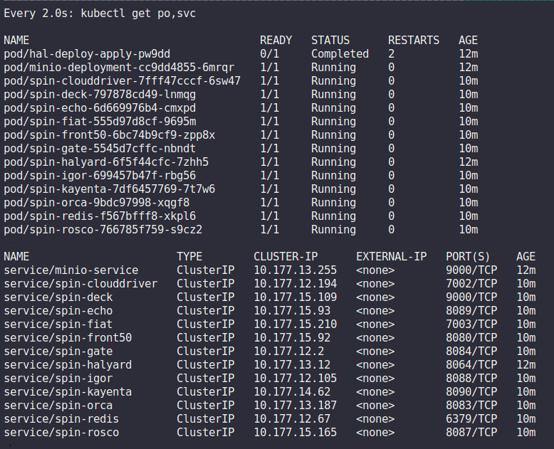
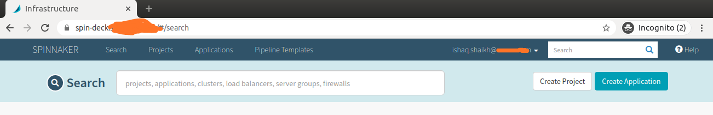
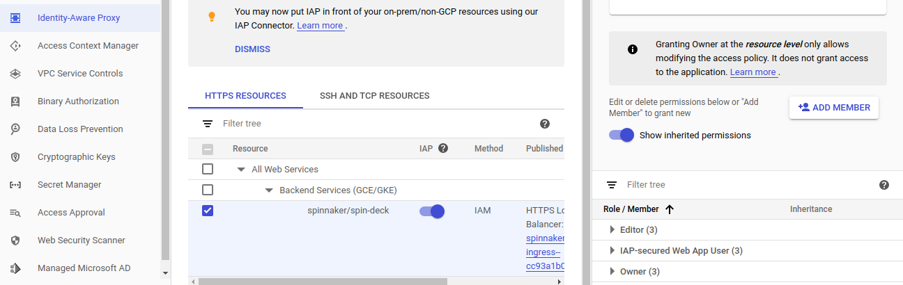

# Google IAP Authentication on Spinnaker running on GKE

This solution deployes the spinnaker on GKE as well as configures the IAP auth mechanism on the spinnaker deck endpoint with TLS enabled.


## Prerequisites

* gcloud util properly installed and gcloud auth configured with neccessary permissions.
* OAuth consent screen properly configured.
* OAuth client id and client secret generated for the Web application.
* External IP with DNS mapped with the ingress host name


## Usage
**Note: Please do read the configurational echo comments properly, specially the last `ACTION REQUIRED` when the script terminate**


#### Step 1. Deploying the spinnaker on GKE (if not deployed)
```
$ kubectl create ns spinnaker
$ kubectl config set-context --current --namespace=spinnaker
$ kubectl apply -f spinstack-on-gke.yaml
```

* The state of the world before running the script, must be seen as follows



#### Step 2. Setting up the **properties** file in the current dir.
For example,
```
...
export PROJECT_ID="" #GCP project id
export IAP_USER="user.name@mydomain.com"  # mail id for the IAP user configuring
export NAMESPACE="spinnaker" # spinnaker deployed namespace name
export DEPLOYMENT_NAME="spinnaker-iap"
export SERVICE_ACCOUNT_NAME="$DEPLOYMENT_NAME-sa-1586329621"
export STATIC_IP_NAME="" #  Static External IP name to be created for the ingress/or if already created 
export MANAGED_CERT="" # Cert file name for the terminating TLS on spin-deck ingress 
export SECRET_NAME="spin-oauth-client-secret" #OAuth secret name for the backend config
export HOST_NAME="spin-deck.mydomain.com" #hostname name for mapping in with the ingress host
....
```

#### Step 3. The "setup_iap.sh" scripts does all of the hard-work and deploys the following resources:
	* A Global static external IP Address for the ingress(if not created).
	* Managed SSL certificate for the spinnaker ingress.
	* Changes the "spin-deck" service type from custerIP to NodePort for the Ingress.
	* Deploys the "deck-ingress" with the above provisioned IP address and SSL cert.
	* Configures the halyard pod with the nessacry IAP configuration changes.


#### Step 4. Run the "setup_iap.sh" script which will do rest of the configuration and resource provisioning work.

```
./setup_iap.sh
```

#### Step 5. Once the spinnaker ingress comes up, the following will be the result with the ingress enabled with TLS.



#### Step 6. Adding more IAP-secured Web App user, go to the below URL **ADD MEMBER** --> **Cloud_IAP.IAP_SECURED_WEB_APP_USER role**




# Any Questions?

Open an issue.


