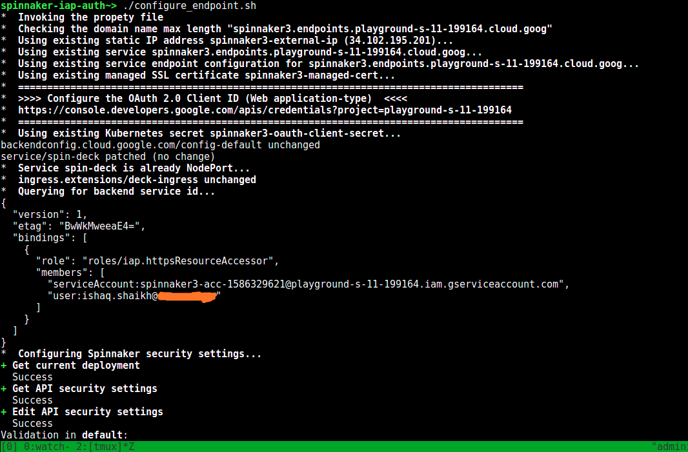

# Google IAP Authentication on Spinnaker

This solution enables the GCP IAP authentication mechanism on the Spinnaker preinstalled on the GKE cluster.

For enabling the IAP follow the given steps:

1. Set the PROJECT_ID and IAP_USER in the **properties** file in the current dir.
For example,
```
PROJECT_ID=my-gcp-project-1234
IAP_USER=octa.cat@gmail.com #The IAP user will be used to configure IAP
```

2. Run the "setup_iap.sh" script which will do rest of the configuration and resource provisioning work.
```
./setup_iap.sh
```

3. The "setup_iap.sh" scripts does all of the hard-work and deploys the following resources:
	1. A Global static external IP Address.
	2. Google service endpoint for spinnaker domain.
	3. Managed SSL certificate for the spinnaker endpoint service.
	4. kubernetes secret from the OAuth client id and client secret.
	5. Create a SA and assing the necessary roles to it.
	6. Changes the "spin-deck" service type from custerIP to NodePort for the Ingress.
	7. Deploys the "deck-ingress" with the above provisioned IP address.
	8. Configures the halyard pod with the nessacry IAP configuration changes and finally deploys the changes

*Make sure to get OAuth client Id and secret for the below following step after step 3*

Below is the screen-shot for re-running the setup_iap.sh again:



4. For adding more IAP-secured Web App user, go to the below URL **ADD MEMBER**
with **Cloud_IAP.IAP_SECURED_WEB_APP_USER role**


https://console.cloud.google.com/security/iap?project=PROJECT_ID


